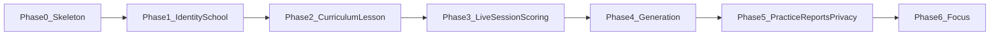
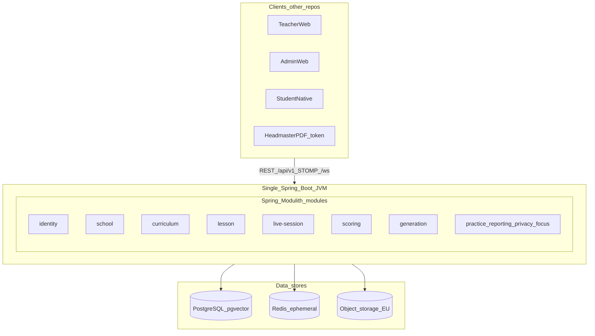
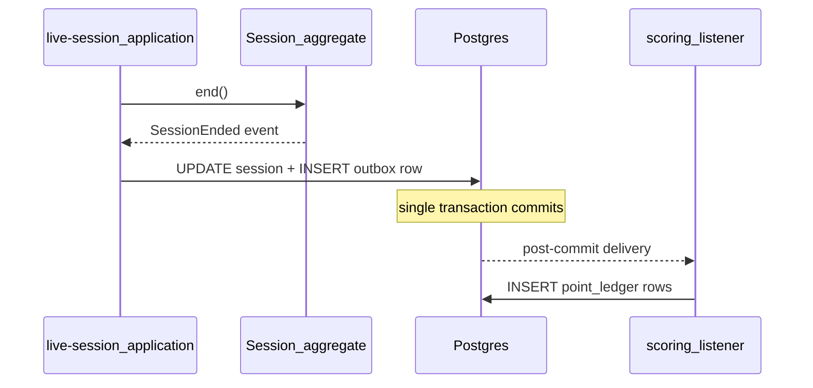
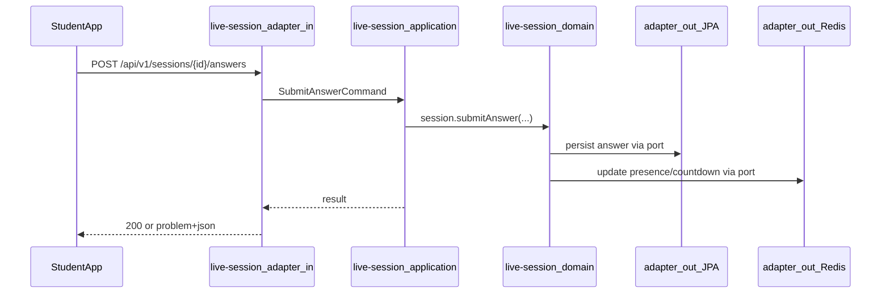
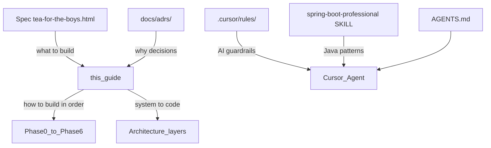

# Build roadmap and architecture guide

This guide is for you as builder and learner. It consolidates the official build order, what to study in each phase, and how the backend is shaped from system level down to code — without repeating the full product spec.

**Canonical sources (read these when you need detail):**

| Document | Role |
|---|---|
| [tea-for-the-boys.html](../spec/tea-for-the-boys.html) | Product truth — FR, BR, UF, EC, E |
| [ADRs](../adrs/README.md) | Engineering decisions and why |
| [overview.md](overview.md) | Short architecture summary |
| [learning-videos.md](learning-videos.md) | YouTube watch list per phase |
| [caching.md](caching.md) | Cache layers and which phase needs them |
| [AGENTS.md](../../AGENTS.md) | Agent and contributor instructions |
| `.cursor/rules/` | AI guardrails (auto-injected in Cursor) |
| `.cursor/skills/spring-boot-professional/SKILL.md` | Java/Spring coding patterns for this repo |

---

## Part 1 — Build phases and what to learn

### Official build order

Do not skip phases. Feature Flyway migrations, JPA entities, REST controllers, and use-cases wait until identity/roster work is explicitly started (architecture freeze).



### How to work incrementally

Do **one sub-phase at a time** (`1.1` then `1.2` …). Do not start `1.5` before `1.1`. Do not skip a parent phase.

Each sub-phase is a **vertical slice** inside one or two modules — not “all domain first, then all REST.”

For every slice, move through the layers in order:

1. **`domain`** — aggregates, value objects, ports (interfaces), invariants
2. **`application`** — use-cases, `@Transactional` boundaries
3. **`adapter.out`** — JPA, Redis, mail, Spring AI, object storage
4. **`adapter.in`** — REST, STOMP, schedulers
5. **Tests** — ArchUnit, Testcontainers, state-machine tests where applicable

Ship something testable at the end of each sub-phase before starting the next.

---

### Phase 0 — Skeleton

**Status:** Done now.

**Modules:** All 11 modules exist as empty hexagonal packages; `sharedkernel` holds shared types.

**What exists today:**

- Maven + Spring Boot 3.4+ single application
- Spring Modulith module boundaries (`@ApplicationModule` on each module)
- Actuator health endpoint only (`HealthSecurityConfiguration` denies all other routes)
- ArchUnit rules (`HexagonalArchitectureTest`) and Modulith verification (`ModulithArchitectureTest`)
- Docker Compose: Postgres (`teacheraid_dev`, pgvector) + Redis

**Incremental milestones (already met):**

- Application starts
- Architecture tests pass
- Local Postgres and Redis available via `docker compose up`

**What to learn:**

- Java 21 and Maven project layout
- Spring Boot basics (application entry, configuration, Actuator)
- Hexagonal architecture (ports and adapters) — see [ADR 0002](../adrs/0002-hexagonal-modules.md)
- Spring Modulith — module boundaries without microservices
- ArchUnit — enforce dependency rules in tests
- Docker Compose — run Postgres and Redis locally

**Blocking assumptions:** None for skeleton work.

**Out of v1 (reminder):** Universities, practical/lab lessons, e-Дневник sync, parent login, billing, national library, streaks, chatbot, class reassignment, co-teaching, grades, GPS, extra device ids, Albanian UI.

---

### Phase 1 — Identity / school / roster

**Status:** Next (when explicitly started).

**Modules:** `identity`, `school`

**ADRs:** [0003 School tenancy](../adrs/0003-school-tenancy.md), [0004 Student OIDC](../adrs/0004-student-oidc.md)

**Sub-phases (do in order):**

| Id | Slice | Done when |
|---|---|---|
| **1.1** | Flyway + Postgres | `flyway.enabled=true`, `ddl-auto=none`, autoconfig excludes removed for JDBC/JPA/Flyway. `V1` tables: `school`, `app_user`, `class`, enrollment — every tenant table has `school_id`. Docker Compose already provides `teacheraid_dev`. |
| **1.2** | Shared kernel | `SchoolId`, `UserId`, `ClassId`, `Clock` as real types (not only `package-info`). |
| **1.3** | School domain + JPA | `SchoolClass` aggregate + `SchoolClassRepository` port; JPA `*Entity` in `adapter.out` only. No REST yet. Testcontainers for load/save. |
| **1.4** | Teacher/admin JWT | Password hash (Argon2id or BCrypt) → JWT with `school_id` and role. Method security. RFC 7807 on `/api/v1`. |
| **1.5** | Roster API | Admin CRUD, soft-delete `left_at`. Teacher scoped to `class.teacher_id = principal` (BR-3). Admin SQL excludes answers/reasons/inbox/per-topic results (BR-4). |
| **1.6** | Invite / reset tokens | Hashed at rest. Routes only — no invented UX (E-12, E-15). |
| **1.7** | Student OIDC | Google Workspace or Entra; one active student session, second device revokes `jti` (FR-6). **Blocked until Assumption A.** |

**What to learn:**

- Spring Security — JWT, method security, filter chains
- Multi-tenancy — tenant from `principal.schoolId()`, never `request.getParameter("schoolId")`
- OIDC integration (Google Workspace / Microsoft Entra)
- Flyway migrations — never `ddl-auto=update` against Postgres
- JPA persistence models in `adapter.out` only; domain stays framework-free
- Password hashing — Argon2id or Spring Security BCrypt
- Testcontainers for Postgres integration tests
- RFC 7807 problem responses under `/api/v1`

**Blocking assumptions:**

- **Assumption A** — every target school issues student mailboxes. If false, student identity collapses. Confirm with pilot school before building student auth.

**Out of scope in this phase:** Live sessions, generation, curriculum ingest, focus lock.

---

### Phase 2 — Curriculum + lesson fixtures (no LLM)

**Status:** After Phase 1.

**Modules:** `curriculum`, `lesson`

**ADRs:** None dedicated; follows [ADR 0002](../adrs/0002-hexagonal-modules.md) hexagonal layout.

**Sub-phases (do in order):**

| Id | Slice | Done when |
|---|---|---|
| **2.1** | Curriculum schema | Subjects, years, units, chunks in Flyway. `rights_cleared_at` column. No textbook ingest until Assumption B. |
| **2.2** | Lesson aggregate + fixtures | Reusable opener, questions, media refs. **Fixture lessons** for later live-session tests. No LLM. |
| **2.3** | Copy-on-write library | School library edits never write back to shared originals. |
| **2.4** | Images + search | EU object storage; timer must not wait (BR-21). pgvector on `curriculum_chunk` when ingest starts. Optional short TTL on rights-cleared unit metadata only after measuring. |

**What to learn:**

- PostgreSQL + pgvector — semantic search over curriculum chunks
- Object storage (EU) for question images — timer must not wait for load (BR-21)
- Copy-on-write pattern for school library
- Domain aggregates (`Lesson`) and value objects
- Cross-module application APIs — `lesson` calls `curriculum` through ports, not shared JPA entities
- Records for commands, queries, and domain events

**Blocking assumptions:**

- **Assumption B** — e-учебник rights with МОН/БРО. Do not ship textbook ingest until written clearance exists (`rights_cleared_at`).

**Out of scope in this phase:** Spring AI, live session, scoring.

---

### Phase 3 — Live session + scoring

**Status:** After Phase 2. This is the hardest phase — build in small slices.

**Modules:** `live-session`, `scoring`

**ADRs:** [0005 Session snapshot](../adrs/0005-session-snapshot.md), [0007 Redis live clocks](../adrs/0007-redis-live-clocks.md)

**Sub-phases (do in order):**

| Id | Slice | Done when |
|---|---|---|
| **3.1** | Session machine + snapshot | Aggregate `lobby → opener → teaching → review → ended`. Snapshot into `session_question` at run (ADR 0005). Illegal-transition tests. |
| **3.2** | Redis join + timers | HMAC join TTL ≤ 30s; server `deadline_at` (ADR 0007, BR-23). Redis loss: refuse joins, pause timers. |
| **3.3** | Answers | Submit with `client_answer_id` idempotency. Durable rows in Postgres only — not Redis. |
| **3.4** | STOMP | `/ws` teacher console vs class view. Class view: no names, no inbox (BR-7). Presence: offline ≠ unanswered (FR-42). |
| **3.5** | End + scoring | Transactional outbox → append-only `point_ledger` + attendance. Redis loss still accepts answers into Postgres. |

Timers (FR-23) and points (FR-74) stay configuration (`timer_policy` / `scoring_policy`), not hard-coded product truth.

**What to learn:**

- WebSocket and STOMP in Spring
- Redis — TTL keys, presence, ephemeral clocks; Postgres remains system of record
- State machines — illegal transition tests
- CQRS-lite STOMP projectors (different payloads for teacher console vs class view)
- Transactional outbox pattern
- Clock port — inject testable time (`Clock` in shared kernel)
- Concurrency under classroom load (~35 students, 15–45 second answer bursts)
- Join specification and HMAC token rotation (EC-9: photographed QR expires)

**Blocking assumptions:**

- Timers (FR-23) and point values (FR-74) are **proposed, not signed**. Store as `timer_policy` / `scoring_policy` configuration; do not hard-code as product truth.

**Out of scope in this phase:** LLM generation, practice sets, PDF reports, focus APIs.

---

### Phase 4 — Spring AI generation

**Status:** After Phase 3.

**Modules:** `generation` (primary); `lesson` and `curriculum` consume via port

**ADRs:** [0006 Spring AI behind GenerationPort](../adrs/0006-spring-ai-generation-port.md)

**Sub-phases (do in order):**

| Id | Slice | Done when |
|---|---|---|
| **4.1** | Port + stub | `GenerationPort` with `generate` / `refine` only. Local stub adapter (E-27). `lesson` never imports Spring AI. |
| **4.2** | ChatClient + firewall | Adapter in `generation.adapter.out`. Null `rights_cleared_at` → no LLM. Roster/names/emails never reach `ChatClient` (FR-70). Characterization test for school email in emphasis. |
| **4.3** | Typed generate / refine | Five refinements (Easier, Harder, More questions, opener debate/prediction, Shorter timers). Four question-type strategies. RAG on loaded unit; three-sentence fallback skips RAG. Teacher reviews before students see content (BR-16). Do not cache LLM output as truth. |

**What to learn:**

- Spring AI / `ChatClient` configuration
- Port/adapter pattern for swappable LLM providers
- Structured JSON output from LLM
- Prompt design without leaking PII
- RAG over pgvector chunks
- Provider configuration vs hard-coded vendor lock-in

**Blocking assumptions:**

- **E-27** — AI provider unspecified; EU region choice (E-41) still open.

**Out of scope:** Chatbot UI, open-ended teacher conversation (BR-17).

---

### Phase 5 — Practice, reporting, privacy

**Status:** After Phase 4.

**Modules:** `practice`, `reporting`, `privacy`

**ADRs:** Tenancy and security patterns from [0003](../adrs/0003-school-tenancy.md).

**Sub-phases (do in order):**

| Id | Slice | Done when |
|---|---|---|
| **5.1** | Practice | Sets from **that session’s missed questions only** — not a general homework system. |
| **5.2** | Dashboards | Teacher: session history + per-student topics (own classes). Admin: usage only — no answers or per-topic student results (BR-4). Optional short TTL after measuring. |
| **5.3** | Headmaster report | Monthly PDF. Unguessable `GET /r/{token}` only — no login (BR-5). Tokens hashed at rest. Never put report URLs on a shared CDN. |
| **5.4** | Privacy | Time-boxed staff grants + audit. Export/delete tickets and retention. Never log answer bodies or inbox text. |

**What to learn:**

- PDF generation for monthly reports
- Unguessable token generation and hashed storage
- Admin query design that excludes sensitive columns at SQL level
- GDPR / ЗЗЛП retention and data-subject request patterns
- Audit logging without logging answer bodies or inbox text

**Blocking assumptions:** None new beyond earlier phases.

**Out of scope:** Parent login, billing, e-Дневnik sync.

---

### Phase 6 — Focus APIs

**Status:** Last.

**Modules:** `focus`

**Sub-phases (do in order):**

| Id | Slice | Done when |
|---|---|---|
| **6.1** | Authorization flag | API the native app can query for focus-lock permission state. |
| **6.2** | Events | `LEFT_FOREGROUND` ingestion. `push_token` is the only device id (FR-66) — no IDFV/GAID. |
| **6.3** | Present-without-phone | Attendance/reporting path for students without a phone. Native UI stays in the other repo. |

**What to learn:**

- Mobile backend event ingestion (native iOS/Android live in **another repository**)
- Apple Family Controls entitlement workflow (**Assumption F**)
- Event-driven attendance signals without device fingerprinting

**Blocking assumptions:**

- **Assumption F** — Apple Family Controls entitlement for focus lock on iOS.

**Out of scope in this repo:** Native app UI, Screen Time / Family Controls implementation.

---

## Part 2 — Architecture from system to code

### 1. System level

TeacherAid v1 backend is **one product API** for a theory lesson in a Macedonian secondary classroom. All clients call this single backend.



**Why one modular monolith, not microservices** ([ADR 0001](../adrs/0001-modular-monolith.md)):

- A live session of ~35 students bursts answers in 15–45 seconds
- Join, timer authority, answers, and End must stay in **one consistency boundary**
- One JVM, one Postgres, one Redis — operational cost stays low
- Spring Modulith package boundaries allow extracting a module later if needed

**Clients (separate repositories):**

| Client | Access |
|---|---|
| Teacher web | Authoring, console, class view, dashboard |
| School admin web | Roster, usage — **never answers** |
| Student native iOS/Android | Join, answer, focus lock |
| Headmaster | No account; monthly PDF + `GET /r/{token}` |
| Support | Time-boxed `staff_access_grant` only |

**Data stores:**

| Store | Role |
|---|---|
| **PostgreSQL** (`teacheraid_dev` locally) | System of record — users, roster, lessons, sessions, answers, point ledger, curriculum chunks + pgvector |
| **Redis** | Ephemeral live state — join HMAC (TTL ≤ 30s), countdown, WS presence, nudge clock, active student `jti`. **Not** the answer store |
| **Object storage (EU)** | Question images; load must not block timer (BR-21) |

On Redis loss: refuse new joins, pause timers, still accept answers into Postgres ([ADR 0007](../adrs/0007-redis-live-clocks.md)).

---

### 2. Runtime and deployment

- **Single Spring Boot process** — `TeacherAidApplication` is the only entry point
- **Local dev:** `docker compose up` starts Postgres (pgvector/pg16) and Redis (redis:7-alpine) per `docker-compose.yml`
- **Health only today:** `HealthSecurityConfiguration` permits `/actuator/health` and denies all other routes until feature security is built
- **No microservice mesh, no separate deploy units in v1**

---

### 3. Module level — Spring Modulith

Eleven application modules, each annotated `@ApplicationModule`:

| Module | Owns |
|---|---|
| `identity` | Teacher/admin password JWT; student OIDC; one active student session; hashed invites/resets |
| `school` | Tenant, classes, roster, one teacher per class, distraction list, `headmaster_email` |
| `curriculum` | Subjects, years, units, chunks + embeddings; `rights_cleared_at` |
| `lesson` | Reusable lesson, questions, media, school-library copy-on-write |
| `generation` | `GenerationPort` only (`generate` / `refine`). No chat UI |
| `live-session` | Run, join, attendance, answers, inbox, skip, ad-hoc, nudge, STOMP |
| `scoring` | Append-only ledger, seasons, leaderboards |
| `practice` | Sets from that session’s missed questions only |
| `reporting` | Dashboards, monthly PDF, unguessable `/r/{token}` |
| `privacy` | Staff grants, audit log, export/delete tickets, retention |
| `focus` | Authorization flag, `LEFT_FOREGROUND` events, present-without-phone |

**Cross-module rules:**

- Modules communicate through **application APIs** and **outbox events**
- **Never** share JPA entities across module boundaries
- Modulith verifies module graph in `ModulithArchitectureTest`

**Shared kernel** (`com.teacheraid.sharedkernel`) stays tiny:

- `SchoolId`, `UserId`, `ClassId`, `Clock` — nothing else

---

### 4. Code level — hexagonal inside each module

Every module uses the same four-layer layout ([ADR 0002](../adrs/0002-hexagonal-modules.md)):

```
com.teacheraid.<module>
  domain          # aggregates, value objects, domain events, ports (interfaces)
  application     # use-cases; @Transactional here only
  adapter.in      # REST, STOMP, schedulers
  adapter.out     # JPA, Redis, mail, Spring AI, object storage
```

**What goes where:**

| Layer | Contains | Must NOT contain |
|---|---|---|
| `domain` | Business rules, aggregates, value objects, port interfaces | Spring Web, JPA on aggregates, Redis, Spring AI imports |
| `application` | Use-case orchestration, transaction boundaries | HTTP concerns, SQL, LLM calls |
| `adapter.in` | Controllers, STOMP handlers, scheduled jobs | Business invariants |
| `adapter.out` | JPA entities/repos, Redis clients, `ChatClient`, S3 | Domain logic |

**Dependency rule (enforced by ArchUnit in `HexagonalArchitectureTest`):**

- `domain` must not depend on `org.springframework.web`, `org.springframework.ai`, or Redis packages
- Persistence models live in `adapter.out`, mapped to/from domain objects in the adapter

**Why not classic Controller–Service–Repository:**

- Prevents invariants leaking into `@Service` if/else
- Keeps JPA entities from becoming the domain model
- Stops Spring AI, Redis, and STOMP from landing in the same service class
- Lets ArchUnit catch illegal imports automatically

**Why not full Clean Architecture:**

- Four rings and a port per table adds ceremony without extra safety for a single-team pilot
- Hexagonal + DDD tactics where invariants exist is the chosen balance

---

### 5. Security and tenancy (cross-cutting)

**Auth audiences:**

| Audience | Mechanism |
|---|---|
| Teacher / school admin | Email + password → JWT (BR-6). No magic links, no school SSO for teachers |
| Student | School-issued email + OIDC (Google Workspace or Entra). Blocked until Assumption A |
| Support | Separate staff IdP; school data only via time-boxed grant |
| Headmaster | `school.headmaster_email` — never an `app_user` row; `GET /r/{token}` only |

**Tenancy** ([ADR 0003](../adrs/0003-school-tenancy.md)):

- Every tenant table has `school_id`
- Tenant comes from the authenticated principal — clients never choose a school id alone
- Teacher: `class.teacher_id = principal` (BR-3)
- Admin: usage queries only; must not select answers, reasons, inbox bodies, per-topic student results (BR-4) — **enforce in queries, not UI**
- Class-view STOMP: no names, no inbox (BR-7)

**Logging and privacy (always):**

- Never log answer bodies, reasons, inbox text, passwords, join tokens, report URLs
- Structured logs with `schoolId` / `sessionId` only
- Roster never sent to an LLM (FR-70)

---

### 6. Key domain patterns (when feature work starts)

These patterns appear across modules once you leave the skeleton:

| Pattern | Where | Spec / ADR |
|---|---|---|
| Session state machine | `live-session` | `lobby → opener → teaching → review → ended` |
| Session snapshot on run | `live-session` | ADR 0005 — answers reference `session_question_id`, not live `question_id` |
| Join HMAC TTL ≤ 30s | `live-session` + Redis | ADR 0007, BR-24 |
| Answer idempotency | `live-session` | `client_answer_id` |
| Transactional outbox on End | `live-session` → `scoring` | Points and attendance settled once |
| Append-only point ledger | `scoring` | No mutable score rows |
| Copy-on-write school library | `lesson` | Edits never write back to shared originals |
| `GenerationPort` boundary | `generation` | ADR 0006 — only `generate` / `refine`; no chat UI |
| PII firewall | `generation` | FR-70, BR-17 |
| Clock port | shared kernel | Testable time in timers and token TTL |
| Strategy for question types | `lesson`, `live-session` | Four question types, five typed refinements |

### 6.1 DDD tactics explained

We use **tactical DDD** where the spec defines an invariant machine — not a strategic DDD programme with separate deployed bounded contexts ([ADR 0002](../adrs/0002-hexagonal-modules.md)). Full learning videos and Spring doc links: [learning-videos.md](learning-videos.md).

#### Aggregate

An **aggregate** is the consistency boundary: one root entity owns the rules, and everything outside references it by id only.

| Aggregate | Module | Owns |
|---|---|---|
| `Session` | `live-session` | State machine, answers in this run, timers for this run |
| `Lesson` | `lesson` | Opener, questions, media references (authoring time) |
| `SchoolClass` | `school` | Roster enrollment, one teacher per class |

**Rules:**

- Load the aggregate, call a method on it, save the whole boundary in one transaction.
- Other aggregates are referenced by `SessionId`, `LessonId`, `ClassId` — not by holding their JPA entities.
- No `@Entity` on aggregate classes; persistence models live in `adapter.out` and map in the adapter.

#### Value object

Small immutable types with equality by value — not by database id.

- Shared kernel: `SchoolId`, `UserId`, `ClassId`, `Clock` (port)
- Examples later: `TimerPolicy`, `ScoringPolicy` (proposed config — FR-23, FR-74)
- Prefer Java `record` for commands, queries, events, and value objects.

#### Domain event

An immutable record of something that **already happened** in the domain — past tense name (`SessionEnded`, not `EndSession`).

```text
Session.end()  →  domain emits SessionEnded  →  application persists + publishes
                                              →  scoring module reacts (points)
                                              →  STOMP projectors push new views
```

- Events are raised **inside** the aggregate after invariants pass.
- Cross-module reactions use Spring Modulith application events ([official events doc](https://docs.spring.io/spring-modulith/reference/events.html)) — not direct calls from `live-session` into `scoring` JPA repos.
- Prefer `@ApplicationModuleListener` for post-commit, async handling so the End transaction stays small.

#### Port (hexagonal)

A **port** is an interface the domain or application defines; **adapters** implement it.

| Port | Implemented by | Example |
|---|---|---|
| `SessionRepository` | JPA adapter in `live-session.adapter.out` | Load/save `Session` aggregate |
| `GenerationPort` | Spring AI adapter in `generation.adapter.out` | ADR 0006 |
| `Clock` | System clock / fixed clock in tests | Timer and join-token TTL tests |

The domain depends on the port interface only — never on Postgres, Redis, or `ChatClient`.

#### Specification

A **specification** encapsulates a business rule you would otherwise copy into if/else.

Example: **join specification** — can this authenticated student join this session now? (enrolled, session in `lobby`, focus authorized, join token valid, one active device session).

Keep specifications as plain domain objects or methods on the aggregate; test them without Spring.

#### Transactional outbox (on End)

When the teacher ends a session, several things must happen reliably: archive session state, write attendance, settle points. Doing Kafka + DB as two separate writes can lose data.

**Pattern:**

1. `Session.end()` transitions to `ended` and emits `SessionEnded`.
2. In **one `@Transactional`** application method: save session + insert outbox/event-publication row.
3. After commit: Modulith event registry (or outbox poller) delivers to `scoring` module.
4. Scoring appends to `point_ledger` (append-only — no updates).

You do **not** need Kafka for v1. One Postgres + Modulith event publication registry is enough ([ADR 0001](../adrs/0001-modular-monolith.md)).



#### CQRS-lite (not full CQRS)

**CQRS** = separate models for **commands** (writes) and **queries** (reads). We use a **lite** version:

- **Commands:** `SubmitAnswerCommand`, `EndSessionCommand` → application → aggregate → Postgres.
- **Queries:** teacher console DTO vs class-view DTO — different shapes, same database.
- **STOMP projectors** subscribe to state changes and push read models over `/ws` ([STOMP docs](https://docs.spring.io/spring-framework/reference/web/websocket/stomp.html)).

We do **not** use: a separate read database, event sourcing as the store of truth, or Kafka for v1.

Class-view is the privacy-critical read model: aggregates only, **no student names, no inbox** (BR-7).

#### What we deliberately skip

| Pattern | Why skipped in v1 |
|---|---|
| Event sourcing | Postgres rows are the truth; ledger is append-only, not full replay |
| Separate read DB | One Postgres + DTO projections is enough |
| Kafka / RabbitMQ | Modulith events + outbox table inside one JVM |
| Strategic DDD (multiple bounded contexts) | One team, one monolith — modules replace separate deployments |

---

### 7. Example request path (conceptual)

When a student submits an answer during a live session:



Flow in words:

1. **HTTP** hits `adapter.in.web` (REST controller)
2. Controller maps to a command record and calls an **application** use-case
3. Use-case loads the **domain** aggregate through a port, applies the invariant, emits events
4. **Outbound adapters** persist to Postgres (durable) and update Redis (ephemeral)
5. STOMP projectors push updated state to teacher console and class view (different payloads)

The domain never knows about HTTP, SQL, or Redis key names.

---

### 8. How this guide relates to other documentation



| Layer | You read it when… |
|---|---|
| **Spec** | You need exact product behaviour (FR/BR/UF/EC/E) |
| **ADRs** | You wonder why something was decided |
| **This guide** | You want the build order, learning path, or architecture map |
| **Rules / skill** | Cursor AI uses these automatically when you code |
| **Overview** | You need a one-page architecture summary |

**Postgres MCP:** Documented as planned for local `teacheraid_dev` only — not configured in the repo yet. When added, it helps AI inspect local schema during development; never connect it to a school database.

**Empty cases:** The spec deliberately leaves some items open (E-*). Do not invent UX or APIs to fill them. If an engineering default is needed to unblock schema work, record it in a new ADR and fail closed.

---

## Quick reference — stack

Java 21 · Spring Boot 3.4+ · Spring Modulith · PostgreSQL + pgvector · Redis · Flyway (when schema starts) · Spring Security (password JWT + student OIDC) · Spring AI `ChatClient` behind `GenerationPort` · STOMP `/ws` · Actuator · Testcontainers · ArchUnit

JSON API under `/api/v1`. Errors as RFC 7807 `application/problem+json`. WebSocket/STOMP under `/ws`.
