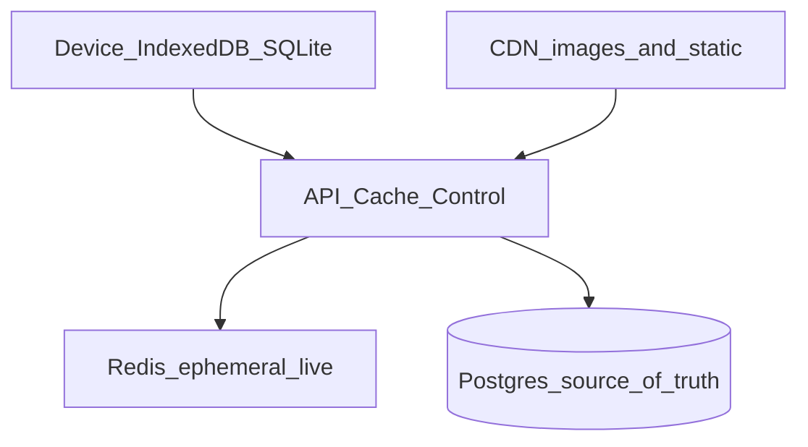

# Caching and performance

Cache **closest to the user** first. Postgres stays the system of record. Redis is ephemeral live state only ([ADR 0007](../adrs/0007-redis-live-clocks.md)).

AI skill: [`.cursor/skills/caching-performance/SKILL.md`](../../.cursor/skills/caching-performance/SKILL.md). Spec: [tea-for-the-boys.html](../spec/tea-for-the-boys.html).

Teacher web, admin web, and student native live in **other repositories**. This note is the contract for those clients and for this API. Do not invent APIs or fill empty cases (E-33, E-49).

## Layers

| Layer | What | Never |
|---|---|---|
| Device | Teacher lesson (FR-43, EC-4); student answer queue (§5.9) | Invent queue TTL or post-End behaviour (E-33) |
| CDN | Question images (BR-21); frontend JS/CSS in other repos | Cache tenant- or session-scoped `/api/v1` JSON |
| HTTP | `Cache-Control` / ETag on public or versioned GETs only | Cache answers, inbox, roster, join tokens, report URLs |
| Redis | Join HMAC ≤ 30s, `deadline_at`, presence, student `jti` | Answers, attendance, or `point_ledger` as cache |
| Postgres | System of record | Bypass with `@Cacheable` on writes or admin-sensitive queries (BR-4) |

## When each phase needs caching

| Phase | Caching? | What |
|---|---|---|
| **0 Skeleton** | No | Docker Redis exists; no cache code |
| **1 Identity / roster** | Almost none | Client holds JWT; no Redis user cache; no `@Cacheable` on roster |
| **2 Curriculum / lessons** | First real need | Object storage + CDN for images (BR-21); optional short TTL on rights-cleared unit metadata after measuring |
| **3 Live session + scoring** | Required (hot path) | Redis clocks/join/presence only; answers → Postgres; FR-43 is a **client** contract; STOMP is push, not HTTP cache |
| **4 Generation** | No result cache | Do not cache LLM output as truth; teacher reviews (BR-16); RAG hits Postgres/pgvector |
| **5 Practice / reports / privacy** | Light | Short TTL on dashboard aggregates after measuring; never put `/r/{token}` URLs on a shared CDN; admin queries still exclude answers (BR-4) |
| **6 Focus** | None as product cache | Persist events; `push_token` is the only device id (FR-66) |

## Backend rules (short)

- Cache keys include `schoolId` (plus `classId` / `sessionId` when scoped).
- Read-through + explicit invalidate on write. No Hibernate second-level cache in v1 unless measured.
- Redis loss: refuse new joins, pause timers, still accept answers into Postgres.
- Authenticated `/api/v1`: `Cache-Control: private, no-store`.
- Class-view STOMP: no names, no inbox (BR-7).
- Do not add `@Cacheable` in Phase 0–1.
